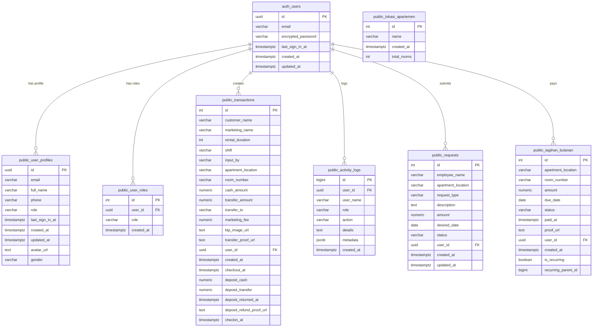
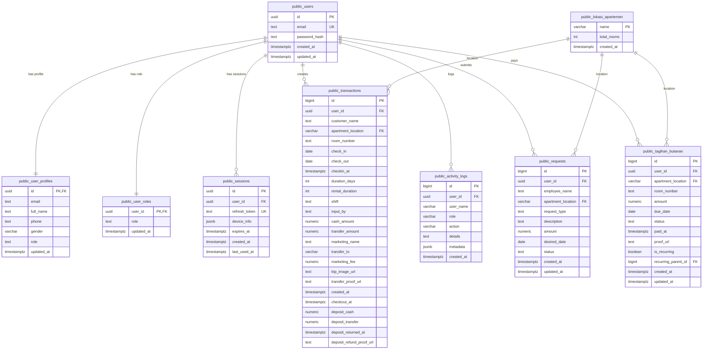
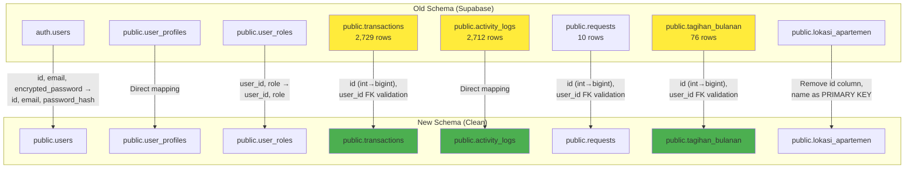
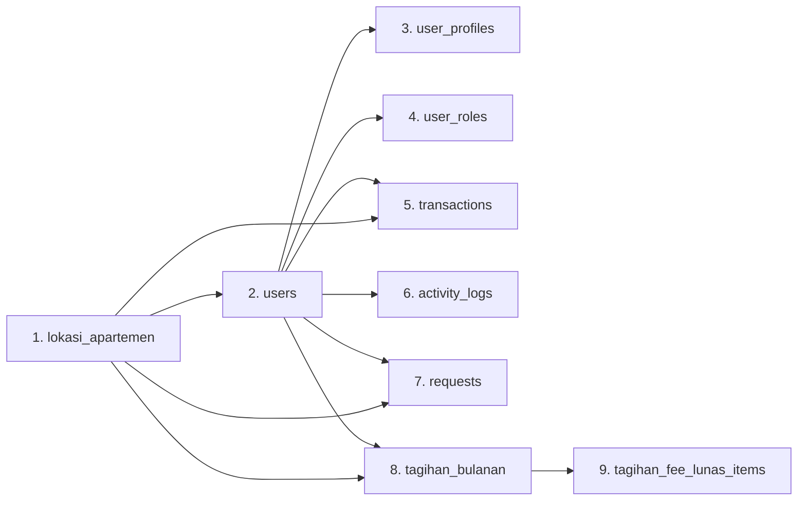

# Data Migration Strategy: Old Supabase Backup → New Clean Schema

**Document Version:** 1.0  
**Date:** August 16, 2026  
**Author:** Architect Mode  

---

## Executive Summary

This document outlines the strategy for migrating data from a Supabase backup (`26052026-backup-complete.sql`) to a new clean PostgreSQL schema defined by existing migrations. The migration preserves 2,729 transactions, 2,712 activity logs, and 76 monthly bills while ensuring compatibility with the current server code.

---

## 1. Architecture Diagram

### 1.1 Old Schema Structure (Supabase Backup)



### 1.2 New Schema Structure (Clean Migrations)



### 1.3 Data Flow Mapping



---

## 2. Migration Strategy Document

### 2.1 Phase 1: Schema Creation

Execute existing migrations in order to create the clean schema:

| Order | Migration File | Purpose |
|-------|----------------|---------|
| 1 | [`001_extensions.sql`](../database/migrations/001_extensions.sql) | PostgreSQL extensions (pgcrypto, uuid-ossp) |
| 2 | [`002_auth_tables.sql`](../database/migrations/002_auth_tables.sql) | Auth tables (users, user_profiles, user_roles, sessions) |
| 3 | [`003_core_tables.sql`](../database/migrations/003_core_tables.sql) | Core tables (lokasi_apartemen, transactions, activity_logs, requests) |
| 4 | [`004_notifications.sql`](../database/migrations/004_notifications.sql) | Notifications & announcements |
| 5 | [`005_finance_tables.sql`](../database/migrations/005_finance_tables.sql) | Finance tables (tagihan_bulanan, tagihan_fee_lunas) |

### 2.2 Phase 2: Data Migration

#### 2.2.1 Migration Order (Respects Foreign Key Dependencies)



**Critical:** Must follow this exact order to satisfy foreign key constraints.

#### 2.2.2 Table-by-Table Migration Mapping

##### Table 1: `lokasi_apartemen`

| Old Column | New Column | Transformation |
|------------|------------|----------------|
| `id` (INTEGER) | *removed* | Drop column (new schema uses `name` as PK) |
| `name` (VARCHAR) | `name` (VARCHAR) PK | Direct copy |
| `created_at` | `created_at` | Direct copy |
| `total_rooms` | `total_rooms` | Direct copy |

**SQL Migration:**
```sql
INSERT INTO public.lokasi_apartemen (name, total_rooms, created_at)
SELECT name, total_rooms, created_at
FROM old_schema.lokasi_apartemen;
```

##### Table 2: `users` (Critical - Server Code Dependency)

| Old Source | New Column | Transformation |
|------------|------------|----------------|
| `auth.users.id` | `id` (UUID) PK | Direct copy |
| `auth.users.email` | `email` (TEXT) UK | Direct copy |
| `auth.users.encrypted_password` | `password_hash` (TEXT) | Rename column |
| `auth.users.created_at` | `created_at` | Direct copy |
| `auth.users.updated_at` | `updated_at` | Direct copy |

**Server Code Expectation:**
```sql
-- From: apps/server/src/modules/auth/auth.service.js:23
SELECT id, email, role, password_hash FROM users WHERE email = $1 LIMIT 1
```

**Challenge:** The `role` column is NOT in `auth.users` - it's in `public.user_profiles` or `public.user_roles`.

**SQL Migration:**
```sql
INSERT INTO public.users (id, email, password_hash, created_at, updated_at)
SELECT 
    id, 
    email, 
    encrypted_password AS password_hash,
    created_at,
    updated_at
FROM old_schema.auth_users;
```

##### Table 3: `user_profiles`

| Old Column | New Column | Transformation |
|------------|------------|----------------|
| `id` (UUID) | `id` (UUID) PK, FK | Direct copy |
| `email` | `email` | Direct copy |
| `full_name` | `full_name` | Direct copy |
| `phone` | `phone` | Direct copy |
| `gender` | `gender` | Direct copy |
| `role` | `role` | Direct copy (with default 'karyawan') |
| `updated_at` | `updated_at` | Direct copy |
| `avatar_url` | *removed* | Not in new schema |
| `last_sign_in_at` | *removed* | Not in new schema |
| `created_at` | *removed* | Not in new schema |

**SQL Migration:**
```sql
INSERT INTO public.user_profiles (id, email, full_name, phone, gender, role, updated_at)
SELECT 
    id, 
    email, 
    full_name, 
    phone, 
    gender, 
    COALESCE(role, 'karyawan') AS role,
    updated_at
FROM old_schema.user_profiles;
```

##### Table 4: `user_roles`

| Old Column | New Column | Transformation |
|------------|------------|----------------|
| `user_id` (UUID) | `user_id` (UUID) PK, FK | Direct copy |
| `role` | `role` | Direct copy |
| `created_at` | `updated_at` | Rename column |

**Note:** Old schema has `id` column (INTEGER), new schema uses `user_id` as PRIMARY KEY.

**SQL Migration:**
```sql
INSERT INTO public.user_roles (user_id, role, updated_at)
SELECT 
    user_id, 
    COALESCE(role, 'karyawan') AS role,
    created_at AS updated_at
FROM old_schema.user_roles;
```

##### Table 5: `transactions` (2,729 rows - Critical)

| Old Column | New Column | Transformation |
|------------|------------|----------------|
| `id` (INTEGER) | `id` (BIGSERIAL) | Type conversion |
| `customer_name` | `customer_name` | Direct copy |
| `marketing_name` | `marketing_name` | Direct copy |
| `rental_duration` | `rental_duration` | Direct copy |
| `shift` | `shift` | Direct copy |
| `input_by` | `input_by` | Direct copy |
| `apartment_location` | `apartment_location` FK | Validate against `lokasi_apartemen.name` |
| `room_number` | `room_number` | Direct copy |
| `cash_amount` | `cash_amount` | Direct copy |
| `transfer_amount` | `transfer_amount` | Direct copy |
| `transfer_to` | `transfer_to` | Direct copy |
| `marketing_fee` | `marketing_fee` | Direct copy |
| `ktp_image_url` | `ktp_image_url` | Direct copy |
| `transfer_proof_url` | `transfer_proof_url` | Direct copy |
| `user_id` | `user_id` FK | Validate against `users.id`, SET NULL if invalid |
| `created_at` | `created_at` | Direct copy |
| `checkout_at` | `checkout_at` | Direct copy |
| `deposit_cash` | `deposit_cash` | Direct copy |
| `deposit_transfer` | `deposit_transfer` | Direct copy |
| `deposit_returned_at` | `deposit_returned_at` | Direct copy |
| `deposit_refund_proof_url` | `deposit_refund_proof_url` | Direct copy |
| `checkin_at` | `checkin_at` | Direct copy |
| *N/A* | `check_in` | NULL (new column) |
| *N/A* | `check_out` | NULL (new column) |
| *N/A* | `duration_days` | NULL (new column) |

**SQL Migration:**
```sql
INSERT INTO public.transactions (
    id, user_id, customer_name, apartment_location, room_number,
    checkin_at, rental_duration, shift, input_by,
    cash_amount, transfer_amount, marketing_name, transfer_to,
    marketing_fee, ktp_image_url, transfer_proof_url,
    created_at, checkout_at,
    deposit_cash, deposit_transfer, deposit_returned_at, deposit_refund_proof_url
)
SELECT 
    id, 
    user_id, 
    customer_name, 
    apartment_location, 
    room_number,
    checkin_at, 
    rental_duration, 
    shift, 
    input_by,
    cash_amount, 
    transfer_amount, 
    marketing_name, 
    transfer_to,
    marketing_fee, 
    ktp_image_url, 
    transfer_proof_url,
    created_at, 
    checkout_at,
    deposit_cash, 
    deposit_transfer, 
    deposit_returned_at, 
    deposit_refund_proof_url
FROM old_schema.transactions;

-- Update sequence to continue from max id
SELECT setval('public.transactions_id_seq', (SELECT MAX(id) FROM public.transactions));
```

##### Table 6: `activity_logs` (2,712 rows)

| Old Column | New Column | Transformation |
|------------|------------|----------------|
| `id` (BIGINT) | `id` (BIGSERIAL) | Direct copy |
| `user_id` | `user_id` FK | Validate against `users.id`, SET NULL if invalid |
| `user_name` | `user_name` | Direct copy |
| `role` | `role` | Direct copy |
| `action` | `action` | Direct copy |
| `details` | `details` | Direct copy |
| `metadata` | `metadata` | Direct copy |
| `created_at` | `created_at` | Direct copy |

**SQL Migration:**
```sql
INSERT INTO public.activity_logs (id, user_id, user_name, role, action, details, metadata, created_at)
SELECT id, user_id, user_name, role, action, details, metadata, created_at
FROM old_schema.activity_logs;

-- Update sequence
SELECT setval('public.activity_logs_id_seq', (SELECT MAX(id) FROM public.activity_logs));
```

##### Table 7: `requests` (10 rows)

| Old Column | New Column | Transformation |
|------------|------------|----------------|
| `id` (INTEGER) | `id` (BIGSERIAL) | Type conversion |
| `employee_name` | `employee_name` | Direct copy |
| `apartment_location` | `apartment_location` FK | Validate against `lokasi_apartemen.name` |
| `request_type` | `request_type` | Direct copy |
| `description` | `description` | Direct copy |
| `amount` | `amount` | Direct copy |
| `desired_date` | `desired_date` | Direct copy |
| `status` | `status` | Direct copy |
| `user_id` | `user_id` FK | Validate against `users.id`, SET NULL if invalid |
| `created_at` | `created_at` | Direct copy |
| `updated_at` | `updated_at` | Direct copy |

**SQL Migration:**
```sql
INSERT INTO public.requests (
    id, employee_name, apartment_location, request_type, description,
    amount, desired_date, status, user_id, created_at, updated_at
)
SELECT 
    id, employee_name, apartment_location, request_type, description,
    amount, desired_date, status, user_id, created_at, updated_at
FROM old_schema.requests;

-- Update sequence
SELECT setval('public.requests_id_seq', (SELECT MAX(id) FROM public.requests));
```

##### Table 8: `tagihan_bulanan` (76 rows)

| Old Column | New Column | Transformation |
|------------|------------|----------------|
| `id` (INTEGER) | `id` (BIGSERIAL) | Type conversion |
| `apartment_location` | `apartment_location` FK | Validate against `lokasi_apartemen.name` |
| `room_number` | `room_number` | Direct copy |
| `amount` | `amount` | Direct copy |
| `due_date` | `due_date` | Direct copy |
| `status` | `status` | Direct copy |
| `paid_at` | `paid_at` | Direct copy |
| `proof_url` | `proof_url` | Direct copy |
| `user_id` | `user_id` FK | Validate against `users.id`, SET NULL if invalid |
| `created_at` | `created_at` | Direct copy |
| `is_recurring` | `is_recurring` | Direct copy |
| `recurring_parent_id` | `recurring_parent_id` FK | Validate against `tagihan_bulanan.id` |
| *N/A* | `updated_at` | Use `created_at` value |

**SQL Migration:**
```sql
INSERT INTO public.tagihan_bulanan (
    id, user_id, apartment_location, room_number, amount,
    due_date, status, paid_at, proof_url,
    is_recurring, recurring_parent_id, created_at, updated_at
)
SELECT 
    id, user_id, apartment_location, room_number, amount,
    due_date, status, paid_at, proof_url,
    is_recurring, recurring_parent_id, created_at, created_at AS updated_at
FROM old_schema.tagihan_bulanan;

-- Update sequence
SELECT setval('public.tagihan_bulanan_id_seq', (SELECT MAX(id) FROM public.tagihan_bulanan));
```

---

## 3. Risk Assessment

### 3.1 Data Loss Risks

| Risk | Severity | Probability | Mitigation |
|------|----------|-------------|------------|
| Foreign key violations during insert | High | Medium | Validate all FK references before insert, use staging tables |
| Missing user IDs in auth.users | Medium | Low | Cross-reference with `user_profiles` before migration |
| Invalid apartment_location values | Medium | Low | Pre-validate against `lokasi_apartemen` table |
| Password hash corruption | Critical | Very Low | Verify encrypted_password format before migration |
| Sequence value mismatch | Low | Medium | Reset sequences after data insert |
| NULL values in NOT NULL columns | Medium | Medium | Use COALESCE with defaults |

### 3.2 Data Integrity Checks

**Pre-migration validation queries:**

```sql
-- Check for orphaned user_ids in transactions
SELECT COUNT(*) FROM old_schema.transactions t
WHERE t.user_id IS NOT NULL 
  AND NOT EXISTS (SELECT 1 FROM old_schema.auth_users u WHERE u.id = t.user_id);

-- Check for orphaned user_ids in activity_logs
SELECT COUNT(*) FROM old_schema.activity_logs al
WHERE al.user_id IS NOT NULL 
  AND NOT EXISTS (SELECT 1 FROM old_schema.auth_users u WHERE u.id = al.user_id);

-- Check for invalid apartment_location values
SELECT DISTINCT apartment_location FROM old_schema.transactions
WHERE apartment_location NOT IN (SELECT name FROM old_schema.lokasi_apartemen);

-- Verify all users have matching profile entries
SELECT u.id, u.email
FROM old_schema.auth_users u
LEFT JOIN old_schema.user_profiles p ON u.id = p.id
WHERE p.id IS NULL;
```

### 3.3 Rollback Strategy

#### Option 1: Database Backup (Recommended)

```bash
# Before migration
pg_dump -U postgres -d kr_db > pre_migration_backup_$(date +%Y%m%d_%H%M%S).sql

# If migration fails
dropdb -U postgres kr_db
createdb -U postgres kr_db
psql -U postgres -d kr_db < pre_migration_backup_YYYYMMDD_HHMMSS.sql
```

#### Option 2: Transaction-based Rollback

```sql
BEGIN;

-- Run all migration statements here
-- If any error occurs, the entire transaction rolls back

-- If successful
COMMIT;

-- If failed
ROLLBACK;
```

#### Option 3: Staging Tables Approach

```sql
-- Create staging schema
CREATE SCHEMA IF NOT EXISTS staging;

-- Migrate to staging first
INSERT INTO staging.users SELECT ... FROM old_schema.auth_users;
-- ... other tables

-- Validate staging data
-- ... validation queries

-- If valid, move to production schema
INSERT INTO public.users SELECT * FROM staging.users;

-- If invalid, drop staging schema
DROP SCHEMA staging CASCADE;
```

### 3.4 Testing Approach

#### Phase 1: Dry Run (Staging Environment)

1. Restore backup to a test database
2. Run migration scripts against test database
3. Verify row counts match expected values
4. Test application connectivity with test database

#### Phase 2: Validation Queries

```sql
-- Verify row counts
SELECT 'users' AS table_name, COUNT(*) AS old_count FROM old_schema.auth_users
UNION ALL
SELECT 'users_new', COUNT(*) FROM public.users;

SELECT 'transactions' AS table_name, COUNT(*) AS old_count FROM old_schema.transactions
UNION ALL
SELECT 'transactions_new', COUNT(*) FROM public.transactions;

SELECT 'activity_logs' AS table_name, COUNT(*) AS old_count FROM old_schema.activity_logs
UNION ALL
SELECT 'activity_logs_new', COUNT(*) FROM public.activity_logs;

-- Verify data integrity
SELECT COUNT(*) AS orphaned_transactions FROM public.transactions t
WHERE t.user_id IS NOT NULL 
  AND NOT EXISTS (SELECT 1 FROM public.users u WHERE u.id = t.user_id);

-- Test authentication query
SELECT id, email, role, password_hash FROM public.users WHERE email = 'admin@example.com' LIMIT 1;
```

#### Phase 3: Application Testing

1. Test login functionality with existing user credentials
2. Verify transaction list displays correctly
3. Verify activity logs display correctly
4. Test CRUD operations on all modules
5. Run analytics queries

---

## 4. Implementation Checklist

### Pre-Migration

- [ ] **Backup current database**
  ```bash
  pg_dump -U postgres -d kr_db > pre_migration_backup.sql
  ```

- [ ] **Verify PostgreSQL version (17.x)**
  ```bash
  psql --version
  ```

- [ ] **Create migration database (if not exists)**
  ```bash
  createdb -U postgres kr_db
  ```

- [ ] **Restore old backup to separate schema**
  ```sql
  CREATE SCHEMA IF NOT EXISTS old_schema;
  -- Restore backup tables to old_schema
  ```

- [ ] **Run pre-migration validation queries**
  - Check for orphaned foreign keys
  - Verify data completeness
  - Document any anomalies

### Migration Execution

- [ ] **Step 1: Run clean schema migrations**
  ```bash
  cd database
  node migrate.js
  ```

- [ ] **Step 2: Migrate lokasi_apartemen**
  ```sql
  INSERT INTO public.lokasi_apartemen (name, total_rooms, created_at)
  SELECT name, total_rooms, created_at FROM old_schema.lokasi_apartemen;
  ```

- [ ] **Step 3: Migrate users (auth.users → public.users)**
  ```sql
  INSERT INTO public.users (id, email, password_hash, created_at, updated_at)
  SELECT id, email, encrypted_password, created_at, updated_at
  FROM old_schema.auth_users;
  ```

- [ ] **Step 4: Migrate user_profiles**
  ```sql
  INSERT INTO public.user_profiles (id, email, full_name, phone, gender, role, updated_at)
  SELECT id, email, full_name, phone, gender, COALESCE(role, 'karyawan'), updated_at
  FROM old_schema.user_profiles;
  ```

- [ ] **Step 5: Migrate user_roles**
  ```sql
  INSERT INTO public.user_roles (user_id, role, updated_at)
  SELECT user_id, COALESCE(role, 'karyawan'), created_at
  FROM old_schema.user_roles;
  ```

- [ ] **Step 6: Migrate transactions (2,729 rows)**
  ```sql
  INSERT INTO public.transactions (...)
  SELECT ... FROM old_schema.transactions;
  SELECT setval('public.transactions_id_seq', (SELECT MAX(id) FROM public.transactions));
  ```

- [ ] **Step 7: Migrate activity_logs (2,712 rows)**
  ```sql
  INSERT INTO public.activity_logs (...)
  SELECT ... FROM old_schema.activity_logs;
  SELECT setval('public.activity_logs_id_seq', (SELECT MAX(id) FROM public.activity_logs));
  ```

- [ ] **Step 8: Migrate requests (10 rows)**
  ```sql
  INSERT INTO public.requests (...)
  SELECT ... FROM old_schema.requests;
  SELECT setval('public.requests_id_seq', (SELECT MAX(id) FROM public.requests));
  ```

- [ ] **Step 9: Migrate tagihan_bulanan (76 rows)**
  ```sql
  INSERT INTO public.tagihan_bulanan (...)
  SELECT ... FROM old_schema.tagihan_bulanan;
  SELECT setval('public.tagihan_bulanan_id_seq', (SELECT MAX(id) FROM public.tagihan_bulanan));
  ```

### Post-Migration

- [ ] **Verify row counts**
  ```sql
  SELECT 'users', COUNT(*) FROM public.users
  UNION ALL SELECT 'transactions', COUNT(*) FROM public.transactions
  UNION ALL SELECT 'activity_logs', COUNT(*) FROM public.activity_logs
  UNION ALL SELECT 'requests', COUNT(*) FROM public.requests
  UNION ALL SELECT 'tagihan_bulanan', COUNT(*) FROM public.tagihan_bulanan;
  ```

- [ ] **Run integrity checks**
  - Verify FK constraints
  - Check for NULL violations
  - Verify sequence values

- [ ] **Test authentication**
  ```sql
  SELECT id, email, role, password_hash FROM public.users WHERE email = 'test@example.com';
  ```

- [ ] **Test application connectivity**
  - Start server
  - Test login endpoint
  - Verify transaction listing
  - Verify activity logs

- [ ] **Clean up old schema**
  ```sql
  DROP SCHEMA old_schema CASCADE;
  ```

- [ ] **Update documentation**
  - Document migration completion
  - Update schema diagrams
  - Note any deviations from plan

---

## 5. Edge Cases & Special Handling

### 5.1 NULL User IDs

Some transactions may have NULL `user_id` values. The new schema allows this with `ON DELETE SET NULL`.

**Handling:** No special action needed. NULL values will be preserved.

### 5.2 Invalid Foreign Key References

If any records reference non-existent users or locations:

**Detection Query:**
```sql
SELECT id, user_id FROM old_schema.transactions
WHERE user_id IS NOT NULL 
  AND NOT EXISTS (SELECT 1 FROM old_schema.auth_users WHERE id = transactions.user_id);
```

**Resolution:** Set to NULL with logging:
```sql
INSERT INTO public.transactions (..., user_id, ...)
SELECT ..., 
       CASE 
         WHEN EXISTS (SELECT 1 FROM public.users WHERE id = t.user_id) THEN t.user_id
         ELSE NULL
       END AS user_id,
       ...
FROM old_schema.transactions t;
```

### 5.3 Role Synchronization

The server code expects `role` in the `users` table, but it's actually in `user_profiles` and `user_roles`.

**Current Server Query:**
```sql
SELECT id, email, role, password_hash FROM users WHERE email = $1 LIMIT 1
```

**Problem:** This query will FAIL because `role` is not in `public.users`.

**Solution Options:**

**Option A: Add role column to users table (Recommended)**
```sql
ALTER TABLE public.users ADD COLUMN role TEXT DEFAULT 'karyawan';

UPDATE public.users u
SET role = COALESCE(
    (SELECT role FROM public.user_roles WHERE user_id = u.id LIMIT 1),
    (SELECT role FROM public.user_profiles WHERE id = u.id),
    'karyawan'
);
```

**Option B: Update server code to JOIN with user_roles**
```sql
SELECT u.id, u.email, ur.role, u.password_hash 
FROM users u
LEFT JOIN user_roles ur ON u.id = ur.user_id
WHERE u.email = $1 LIMIT 1
```

**Recommendation:** Use **Option A** for simplicity and to match server code expectations.

### 5.4 Generated Columns

The new `transactions` table has generated columns:
- `payment_cash` = `cash_amount` (STORED)
- `payment_transfer` = `transfer_amount` (STORED)

**Handling:** These columns are auto-generated. Do NOT attempt to insert values into them.

### 5.5 Missing Columns in Old Schema

New columns in the clean schema that don't exist in the old schema:
- `transactions.check_in` (DATE)
- `transactions.check_out` (DATE)
- `transactions.duration_days` (INTEGER)

**Handling:** These will be NULL after migration. Can be backfilled later if needed.

---

## 6. Success Criteria

| Metric | Target | Validation Method |
|--------|--------|-------------------|
| Users migrated | 8 rows | `SELECT COUNT(*) FROM public.users` |
| Transactions migrated | 2,729 rows | `SELECT COUNT(*) FROM public.transactions` |
| Activity logs migrated | 2,712 rows | `SELECT COUNT(*) FROM public.activity_logs` |
| Requests migrated | 10 rows | `SELECT COUNT(*) FROM public.requests` |
| Tagihan migrated | 76 rows | `SELECT COUNT(*) FROM public.tagihan_bulanan` |
| Authentication works | Login success | Test with existing user credentials |
| No orphaned FKs | 0 records | FK validation queries |
| Application starts | No errors | Server startup test |

---

## 7. Timeline Estimate

| Phase | Duration | Notes |
|-------|----------|-------|
| Pre-migration preparation | 30 min | Backup, validation queries |
| Schema creation | 5 min | Run existing migrations |
| Data migration | 15 min | Execute INSERT statements |
| Validation | 15 min | Row counts, integrity checks |
| Application testing | 30 min | Manual testing of all features |
| Cleanup | 5 min | Remove old schema |
| **Total** | **~1.5 hours** | |

---

## 8. Next Steps

1. **Review this strategy document** with stakeholders
2. **Create migration script** in Code mode based on this strategy
3. **Test migration** in staging environment
4. **Schedule production migration** during low-traffic window
5. **Execute migration** with rollback plan ready
6. **Verify and document** results

---

## Appendix A: Migration Script Template

See [`database/migrate-from-backup.sql`](../database/migrate-from-backup.sql) (to be created by Code mode).

## Appendix B: Validation Script Template

See [`database/validate-migration.sql`](../database/validate-migration.sql) (to be created by Code mode).
